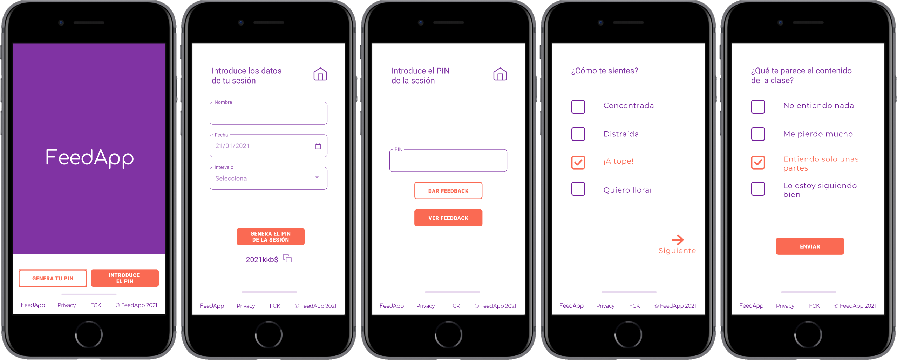

# Welcome to feedApp!

## The project

A **responsive web app (mobile-first)** conceived to help you get **live feedback** from your students on your online trainings. Students will be able to let you know how they are feeling in real time about the contents and pace of the training session, or their current state of mind.

## The team

We are [Ana](https://github.com/anamartinezfernandez), [Ángela](https://github.com/chicano85), [Araceli](https://github.com/AraceliLobo) and [Celia](https://github.com/Celiamf), four **motivated Front-End Women Developers** who code to learn and make nice things for others.

## The design



## The technology

This web app is being developed using **React.js**, **CSS (Sass)** and **Node.js**.

## Get it started

We are also using **node**, so if you want to open the project, clone the repo & run the following commands in your terminal:

```bash
npm install
```

```bash
npm start
```
